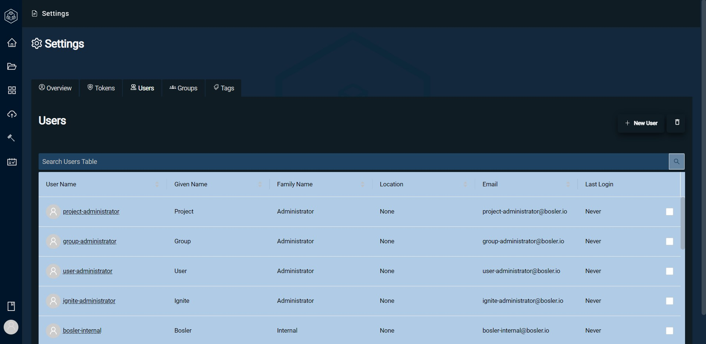
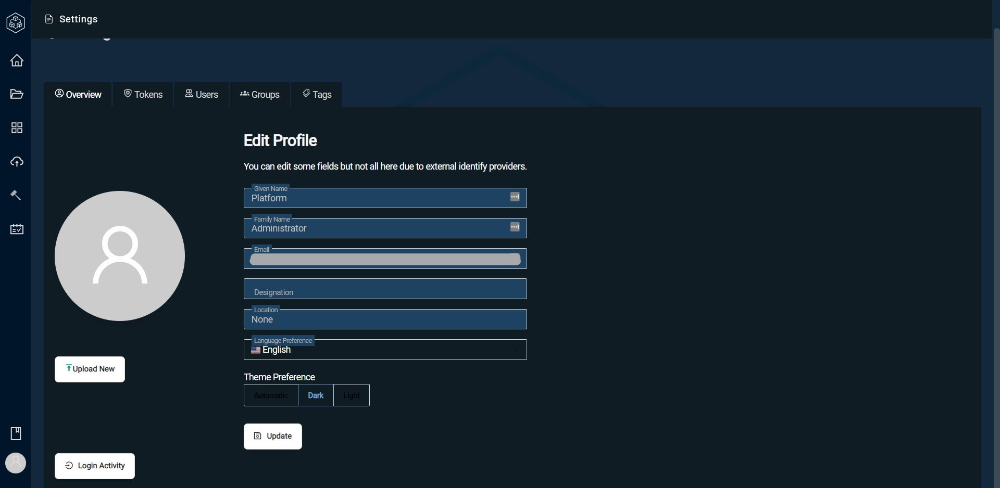

# User Management

 Bosler allows administrators to manage users in Bosler on one page.

In this page located under Bosler settings, it is simple to quickly see all users in the Bosler environment and key details such as:

- Username
- Email
- Last Login
- Plus, many more

## Creating Users

Creating a user in Bosler is a simple process.

- Navigate to the Settings page and go to the User tab
- On the top right of the page, select New User
- Enter details of the user
- Select Create

## Finding more detail about User

Hovering over a user in the User tab will pop up a box showing details. Here you can see which level of which group this user is in. For example, the Project administrator down below is in the Test Repository Members of the Test Group.

## Editing Users

Users can edit their own profile at any time by selecting their personal user profile in the User tab. This will update their profile with their new details.

