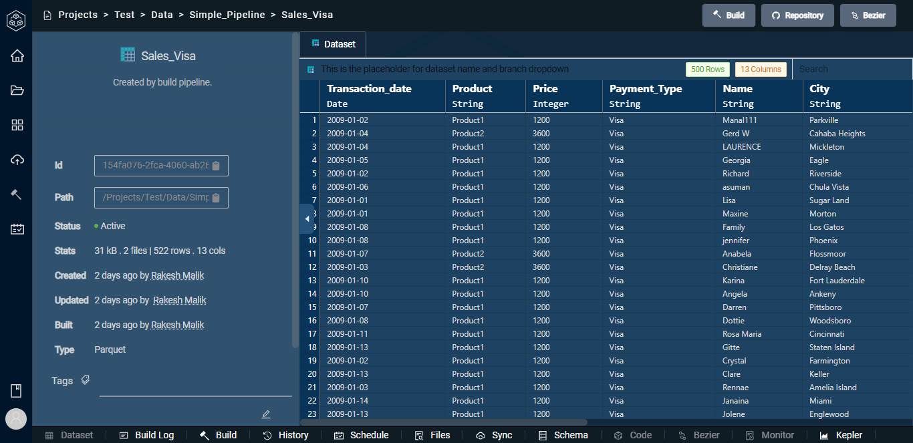
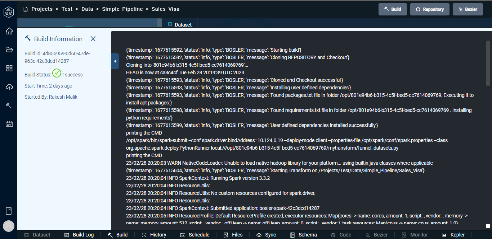
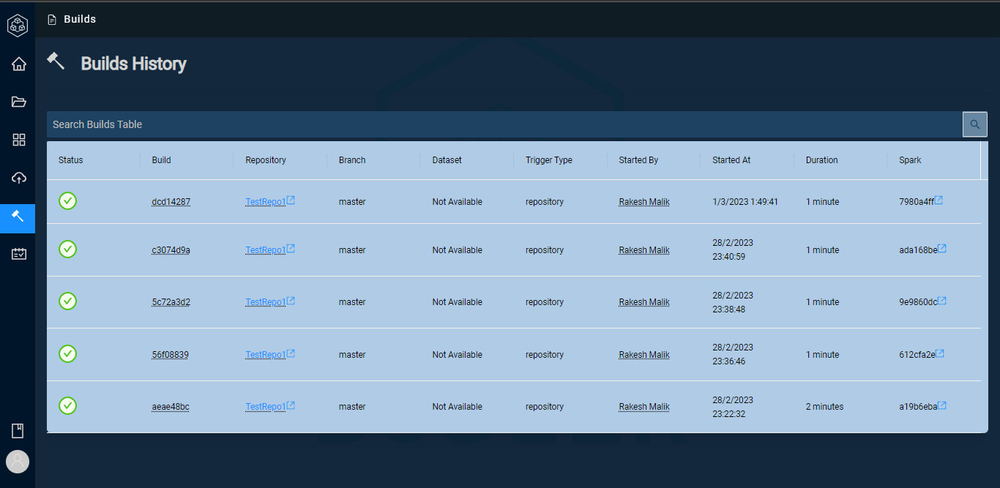

# Builds

 A build is the process of compiling source code into an executable software application or library.

The build process typically involves compiling the code, linking it with external libraries, and creating an installable package that can be deployed to a target environment. The build process can be automated using build tools like Gradle. Automating the build process along with scheduling can save time and ensure consistency across environments.

You can start the build process after updating a particular dataset.

<b>You just click on Build which is the hammer icon here and the process begins automatically.</b>

<b>You just click on Build which is the hammer icon here and the process begins automatically.</b>

<b><i><u>Note:</i></u> This is the Normal Build.</b>

### <b>Build Log</b>

You can also view the build log which provides a record of the build process that is used to track the progress of building software. A build log typically includes information about the build process, such as the commands executed, the results of each command, and any errors or warnings that occurred during the build.

Build logs are useful for a number of reasons. They provide a detailed record of the build process, which can be used for debugging purposes if errors occur. By analyzing build logs, developers can identify trends and patterns in the build process, which can help identify opportunities for improvement.

### <b>Build History </b>

<b>
To check your builds history click on Builds using the sidebar menu: </b>

In Build History you can view :

- Build ID
- Repository
- Branch
- Dataset
- Trigger Type
- The Author
- TimeStamp
- Duration
- Spark

