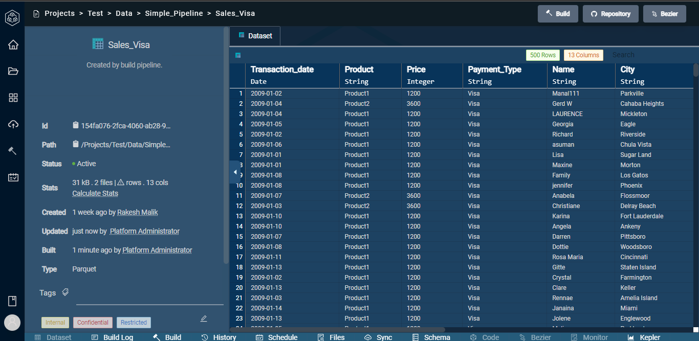
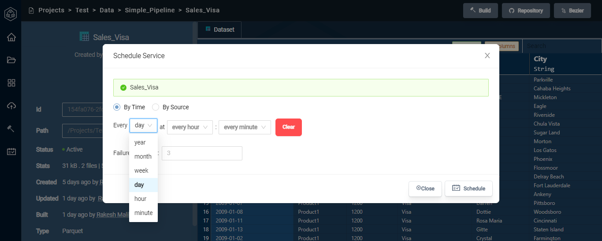
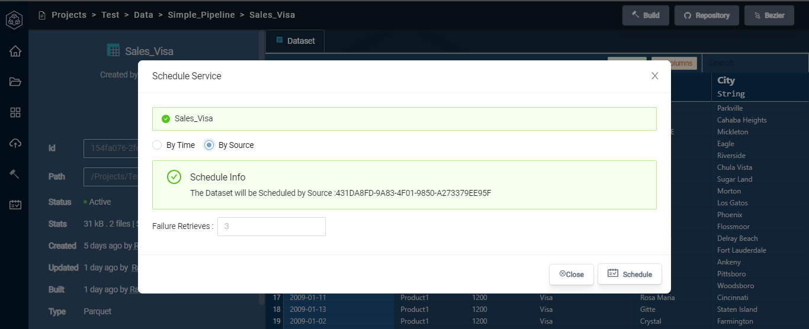
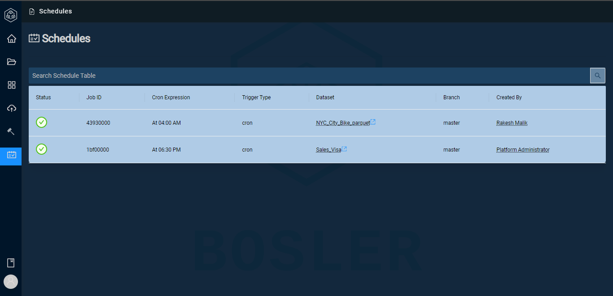

# Scheduling

 A schedule is a recurring build task that ensures a steady flow of data in Bosler. The trigger in a schedule determines when the build should run.

A schedule is considered executed when the trigger conditions are met, and the build is performed. If a schedule is triggered while another is still running, it will remain on hold until the current schedule is completed before being executed.

Scheduling and Builds are linked together. You can set triggers to schedules builds of datasets in Bosler

## Creating a schedule

In any datasets, there is a schedule option below.

Selecting the Schedule option, you can choose exactly when you want to trigger this build consistently automatically.

### Customising Triggers

You are able to customise the schedule trigger down to the second giving you all options to ensure you can use Bosler to your liking.

You can customize either by time or by source.

To check your schedules table, click on the schedules on the sidebar menu.

