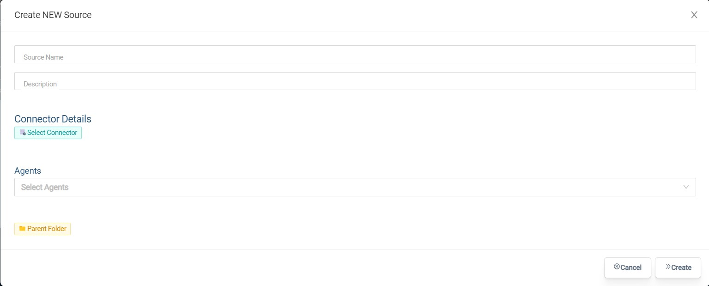

# Les sources de données

 Une source de données est tout système de données externe pouvant être connecté à Bosler. Les exemples d'une source de données incluent, mais ne sont pas limités à :

- Base de données Postgres
- Godet S3
- Instance SAP
- API REST sur Internet

Pour établir une connexion à Bosler, une source de données configurée est requise. Il est important de noter qu'une source de données ne peut pas être utilisée directement dans Bosler, les données doivent être synchronisées dans un ensemble de données avant de pouvoir être utilisées.

## Conditions préalables

Avant de configurer une source, assurez-vous que vous disposez des informations d'identification et des autorisations d'accès nécessaires au système de données.

## La source de données

Ce guide vous guidera tout au long du processus d'ajout d'une source de données. L'utilisateur doit être un administrateur de plateforme pour importer une source de données. Pour l'importer :

- Connectez-vous à votre compte
- Accédez à Connexion de données à l'aide du menu de la barre latérale

- Aller à + Nouveau
- Sous l'onglet source, sélectionnez l'option "Source" dans le coin supérieur droit

- Entrez le nom de la source avec les détails du connecteur pour le connecteur souhaité et l'agent précédemment créé plus le dossier parent
- Cliquez sur Créer

