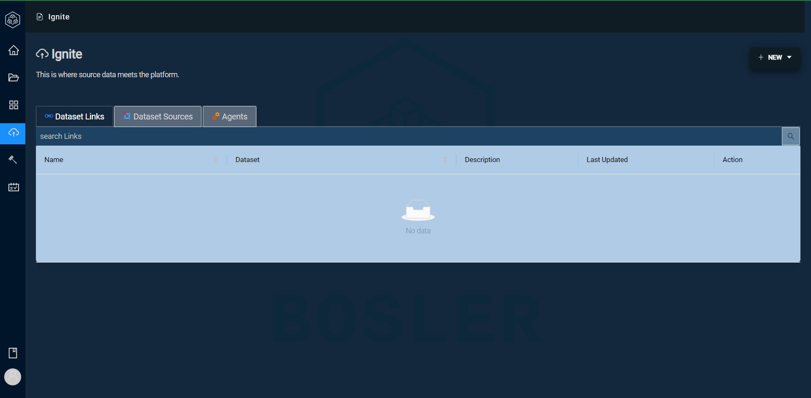
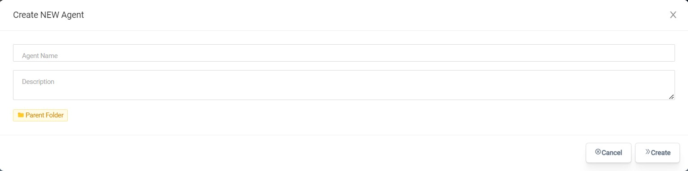

# Installer des agents

Un programme appelé Agent peut être téléchargé et ajouté à votre réseau organisationnel. Il est géré via l'interface de connexion de données de Bosler, également connue sous le nom d'Ignite.
L'agent peut se connecter à diverses sources de données au sein de votre réseau et sa fonction principale est de récupérer les données de ces sources et de les envoyer en toute sécurité à Bosler à l'aide d'un jeton d'accès sécurisé.

## Ignite

Le logiciel Agent interne de Bosler s'appelle Ignite.

## Créer un agent

Ce guide vous guidera tout au long du processus de création d'un agent à l'aide d'Ignite. De plus, vous pouvez trouver un didacticiel pas à pas pour créer un agent dans Data Connection. Pour y accéder :

- Connectez-vous à votre compte
- Accédez à Connexion de données à l'aide du menu de la barre latérale

- Sous l'onglet Agents, sélectionnez l'option "Nouvel agent" dans le coin supérieur droit

- Entrez le nom de l'agent avec la description et le dossier parent
- Cliquez sur Créer

Une fenêtre contextuelle devrait apparaître avec les détails de l'agent avec un lien à usage unique pour l'agent.
Entrez la commande dans le terminal pour installer l'agent côté client.

### Note

Cela ne fonctionne que pour Linux et MacOS

