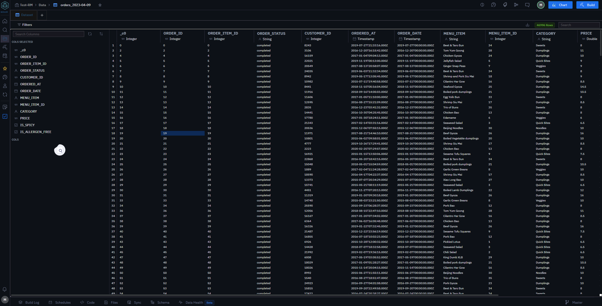

# Dataset

# Overview

Name: [Dataset Name]
Description: A brief summary of what the dataset contains and its intended use. For example, "The Customer Transactions dataset includes records of all transactions made by customers on our e-commerce platform, including details such as transaction amounts, timestamps, and customer IDs."

1. Data Fields
    Field Name: [Field Name]
    Description: Explanation of what this field represents.
    Data Type: [e.g., String, Integer, Date, Boolean]
    Format/Constraints: Specific format requirements or constraints (e.g., YYYY-MM-DD for dates, length constraints).
    Example Value: An example of what this field might contain.
    (Repeat for each field in the dataset.)

2. Data Structure
    Format: [e.g., CSV, JSON, SQL Database]
    Schema: Outline of the dataset's schema, if applicable (e.g., table structure for SQL databases).
    Sample Data: A sample or snippet of the dataset to illustrate the structure and content.

3. Source and Collection
    Source: Where the data originates from (e.g., user inputs, external databases, sensors).
    Collection Method: How the data is collected (e.g., automated processes, manual entry).

4. Usage and Access
    Access Rights: Information on who can access the dataset and under what conditions (e.g., public, restricted to certain users).
    How to Access: Instructions or links for accessing the dataset (e.g., API endpoints, download links).

5. Data Quality and Maintenance
    Quality Checks: Any quality checks or validation processes applied to the data.
    Update Frequency: How often the dataset is updated (e.g., real-time, daily, weekly).
    Historical Data: Information on historical data retention and versioning, if applicable.