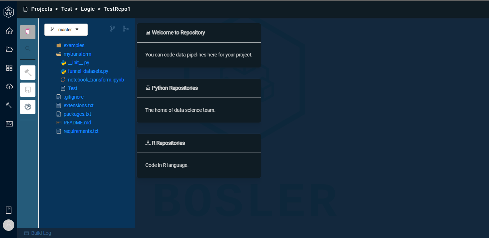
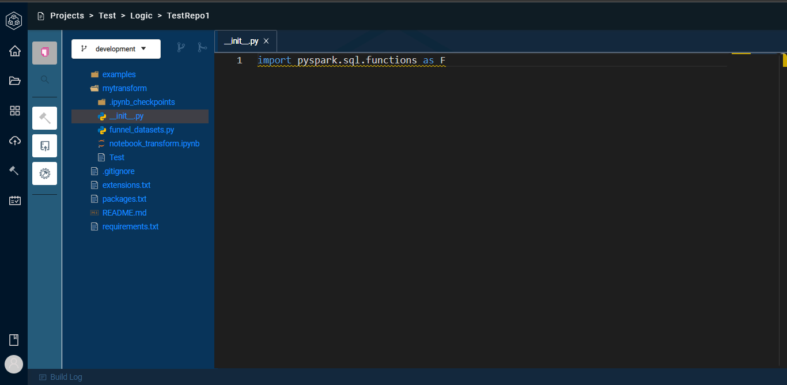
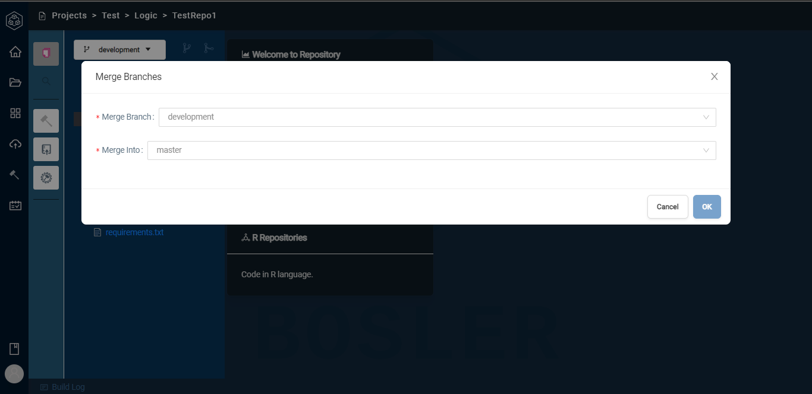
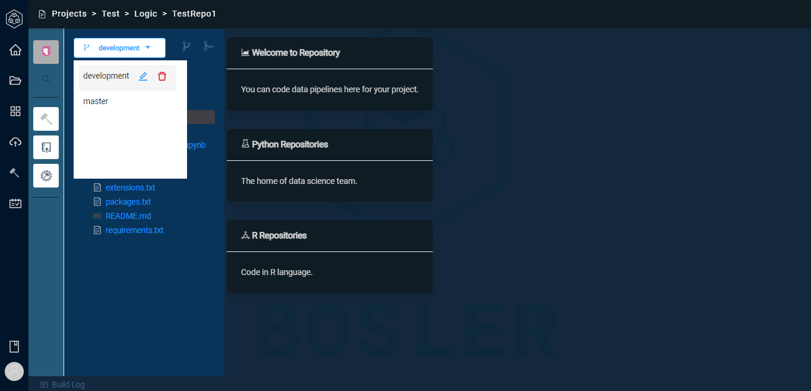

# Branches

## Overview

Bosler allows a distributed version control system that allows developers to work on multiple versions of a codebase simultaneously. Branches provide a way to isolate work on a particular feature or bug fix without affecting the main codebase.

In general, Bosler branches allow developers to work independently on different parts of a codebase, collaborate on features and bug fixes, and keep track of changes made to the codebase over time.

Here is a brief explanation of a branch:

Master Branch: The master branch is the main branch of the Bosler repository. It typically contains the latest stable version of the codebase.

## How you can create a branch:

- Log in to your account
- Go to Projects using the sidebar menu
- Select your active project
- Select your repository

Here is how your page would look like:

By default Bosler will show you the master branch.

To create a new branch you click on the three branch logo:

:::note
You can name the branch according to the precise function in lowercase only.
:::

And a new branch to work on a specific feature, enhancement is created.

:::note
You cannot delete the master branch.
:::

You can pull latest code from either one of the branches if required.

## How to merge one or more branches

You can merge one or more branches where changes made in one branch are added with the changes made in another branch. This is typically done when a developer wants to incorporate the changes they've made in a feature branch or a bug fix branch back into the main branch (usually the master branch).

Select which branch you want to merge with the master branch, and it will be merged as soon as changes are committed.

You can merge multiple branches into the master branch.

Consider master branch to be the constant branch.

## How to delete branches

After a developer has wrapped up working on different parts of a codebase, fixing bugs, they can wish to delete that branch if it doesn't serve them for future purposes.

- To delete a particular branch, click on the branch dropdown and press the bin icon to delete the branch.

- Bosler will ask you to confirm the name of the branch you wish to delete.

