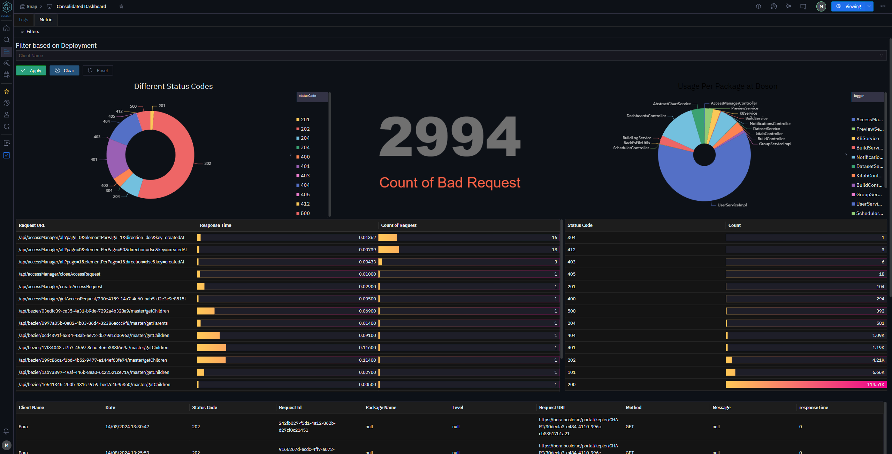

# Tableau de bord

Les tableaux de bord sont un moyen d'afficher une gamme de graphiques et de données directement dans Bosler.
Les tableaux de bord utilisent une solution de glisser-déposer pour ajouter et modifier différents graphiques et vues.

## Fonctionnalités

Lors de la personnalisation d'un tableau de bord, les utilisateurs peuvent ajouter tous les types de graphiques et même utiliser des titres et du markdown pour ajouter des informations supplémentaires.
Au sein d'un même tableau de bord, vous pouvez avoir plusieurs onglets en utilisant la barre supérieure avec des options pour changer les noms des onglets afin de faciliter l'organisation.

Les utilisateurs peuvent accéder à des graphiques individuels dans les tableaux de bord et être redirigés vers eux pour les modifier rapidement sans avoir à naviguer manuellement. En cliquant sur les 3 points sur n'importe quel composant du tableau de bord, une gamme d'options s'ouvre. Les tableaux de bord peuvent être affichés en plein écran en utilisant l'option plein écran dans le menu des 3 points.