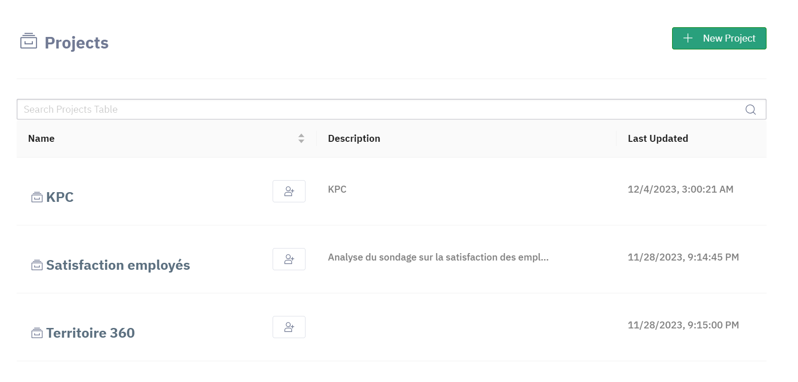

# Présentation des projets

Un projet est l'unité organisationnelle centrale de Bosler. Il comprend la visualisation (graphiques, tableau de bord), la logique (pipeline de données), les données et la documentation. Un projet est isolé avec sécurité afin que seul un ensemble autorisé d'utilisateurs puisse accéder à l'espace.

# Accueil des projets

Votre page de destination par défaut dans Bosler est la page Projets. Vous pouvez retrouver rapidement les projets que vous avez créés, ainsi que ceux partagés avec vous et votre espace de travail.

:::caution
Vous devez être administrateur de projet pour pouvoir créer de nouveaux projets. Vous pouvez demander à un administrateur de projet de créer un nouveau projet pour vous.
:::

# Description et Titre

Le titre et la description d'un projet sont visibles à plusieurs endroits :

- Dans la Vue Logique du projet
- Dans la page Projets
- Facultativement, dans l'application publiée (voir les informations sur les métadonnées de l'application)

:::tip
Vous pouvez modifier le titre et la description simplement en cliquant dessus et en les modifiant.
:::
