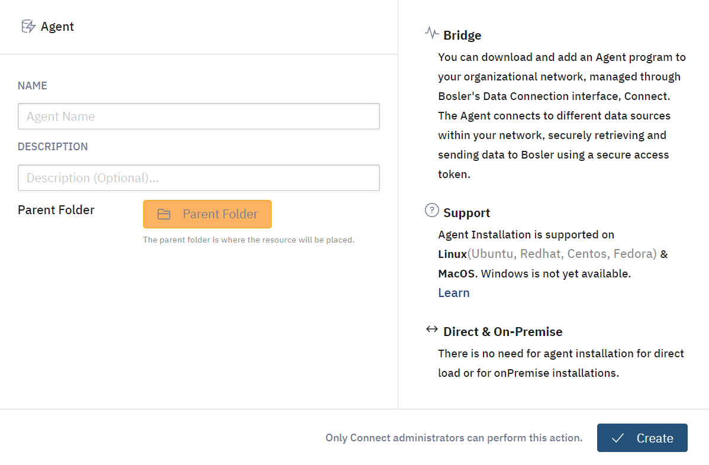
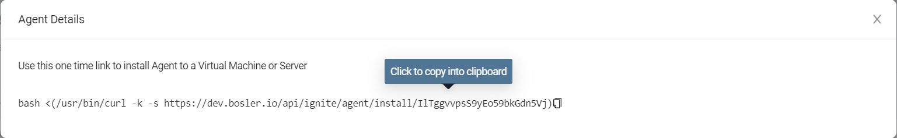

# Installer des agents

Un Agent est un programme qui peut être téléchargé et ajouté au sein de votre réseau. Il est géré via l'interface de connexion de données.
L'agent peut se connecter à diverses sources de données et sa fonction principale est de récupérer les données de celles-ci et de les envoyer en toute sécurité dans la plateforme à l'aide d'un jeton d'accès sécurisé.

## Ignite

Le logiciel d'agent de collecte de données de Bosler s'appelle Ignite.

## Créer un agent

Vous pouvez également trouver un tutoriel pour créer un agent dans Data Connection. 

- Connectez-vous à votre compte
- Accédez à Connexion de données à l'aide du menu de la barre latérale

- Sous l'onglet Agents, sélectionnez l'option "Nouvel agent" dans le coin supérieur droit

- Entrez le nom de l'agent avec la description et le dossier parent
- Cliquez sur Créer

Un pop-up devrait apparaître avec les détails de connection ainsi qu'un lien à usage unique pour l'agent.
Entrez la commande dans le terminal pour installer l'agent côté client.

:::note

Cela ne fonctionne que pour Linux et MacOS

:::
