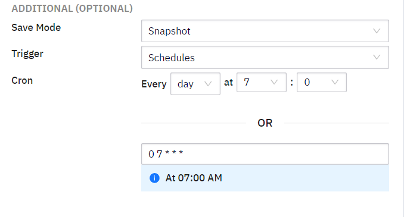
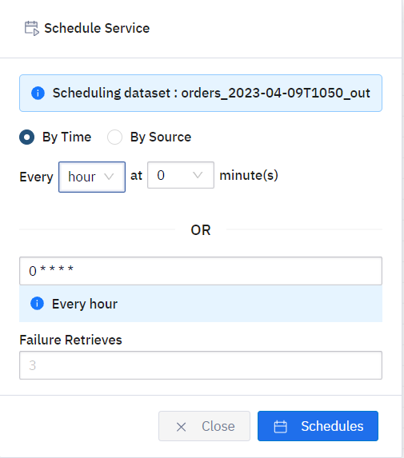
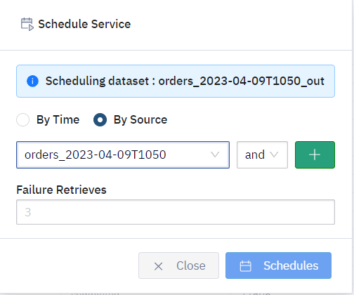
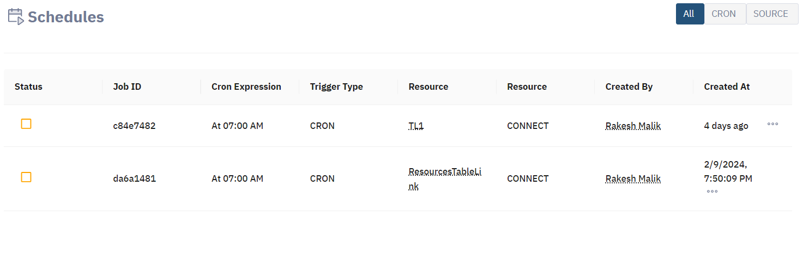

# Planification

Une planification est une tâche de génération récurrente qui assure un flux constant de données dans Bosler. Le déclencheur dans une planification détermine quand la génération doit s'exécuter.

Une planification est considérée comme exécutée lorsque les conditions de déclenchement sont remplies et que la génération est effectuée. Si un programme est déclenché alors qu'un autre est encore en cours d'exécution, il restera en attente jusqu'à ce que le programme en cours soit terminé.

La planification et les builds sont liés. Vous pouvez définir des déclencheurs pour planifier les builds des datasets.

## Créer un horaire

Dans tous les datasets, il existe l'option de planification ci-dessous :

En sélectionnant l'option Planifier, vous pouvez choisir exactement quand vous souhaitez déclencher ce build de manière cohérente et automatique.

### Personnaliser les déclencheurs

Vous pouvez configurer le déclencheur de planification à la seconde près.

Vous pouvez personnaliser soit par heure, soit par source.

Pour vérifier votre tableau des horaires, cliquez sur Planification dans le menu de la barre latérale.

