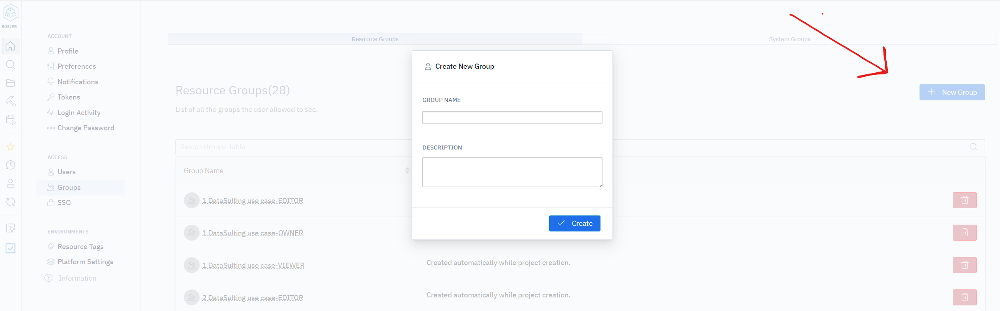
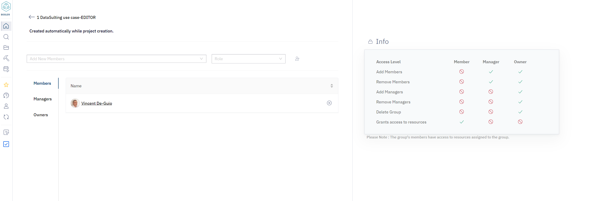

# Gestion des Groupes

Dans Bosler, les Administrateurs peuvent créer des groupes de sécurité et ont un accès complet et un contrôle total sur ces groupes pour déléguer des rôles de sécurité à certains utilisateurs.

Les Administrateurs peuvent accéder aux paramètres de gestion des groupes dans la page des Paramètres sous l'onglet Groupes.

Tous les groupes seront répertoriés ici avec la possibilité de modifier, supprimer et créer de nouveaux groupes. Lors de la configuration initiale de Bosler dans votre établissement, trois groupes seront préconfigurés :

- Administrateurs des Utilisateurs
- Administrateurs de Groupe
- Administrateurs de Projet

Les groupes peuvent aider à gérer les permissions des utilisateurs de Bosler. Ils peuvent varier de la consultation uniquement à l'édition. Le système de gestion des groupes de Bosler facilite la délégation des permissions à un groupe de personnes.

## Création d'un Groupe

La création d'un groupe dans Bosler est un processus simple.

- Accédez à la page des Paramètres et allez à l'onglet Groupes
- En haut à droite de la page, sélectionnez "nouveau groupe"
- Entrez le Nom du Groupe et une description du groupe (Optionnelle)

### Gestion d'un Groupe

| Niveau d'Accès                    | Membre | Responsable | Propriétaire |
|----------------------------------|:------:|:-----------:|:------------:|
| Ajouter des Membres              |   ❌   |     ✔️      |      ✔️      |
| Supprimer des Membres            |   ❌   |     ✔️      |      ✔️      |
| Ajouter des Responsables         |   ❌   |     ❌      |      ✔️      |
| Supprimer des Responsables       |   ❌   |     ❌      |      ✔️      |
| Supprimer le Groupe              |   ❌   |     ❌      |      ✔️      |
| Accès aux ressources            |   ✔️   |     ❌      |      ❌      |

Vous pouvez cliquer sur un groupe et gérer les membres, responsables et propriétaires.

Les Membres sont le rôle de base dans un groupe, ils ne peuvent pas modifier les groupes et ne peuvent accéder qu'au groupe de projet auquel ils ont été assignés dans Bosler.

Les Responsables peuvent modifier le groupe pour ajouter ou supprimer des utilisateurs, tandis que les Propriétaires ont également le rôle supplémentaire de suppression.

