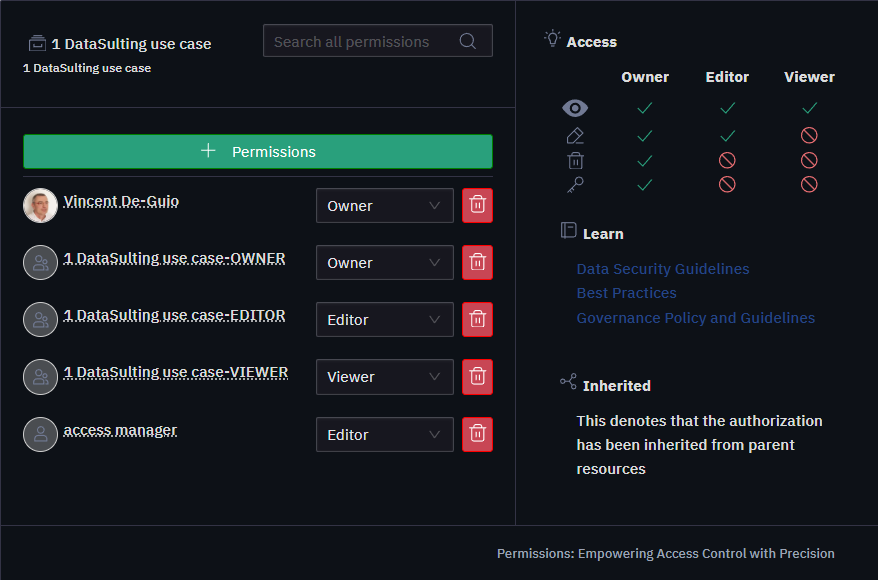

# Sécurité des Ressources

## Qu'est-ce que la Sécurité des Ressources ?

La sécurité des ressources sur une plateforme de données fait référence aux mesures et pratiques mises en place pour protéger les ressources de données (telles que les ensembles de données, les bases de données, les fichiers et les capacités de traitement) contre l'accès non autorisé, l'utilisation abusive, la corruption ou le vol. Étant donné la nature critique des données dans les entreprises modernes, garantir la sécurité des ressources sur une plateforme de données est primordial pour maintenir l'intégrité, la confidentialité et la disponibilité des données.

## Capacité d'Accès sur la Plateforme

Sur notre plateforme, une variété de ressources est disponible, y compris des projets, des dossiers, des fichiers, des graphiques, des tableaux de bord, des dépôts, et plus encore. Pour gérer l'accès et le contrôle sur ces ressources, nous avons établi trois niveaux de permissions distincts : **Propriétaire**, **Éditeur** et **Visualiseur**.

1. **Propriétaire** : Un individu avec des permissions de Propriétaire possède le niveau de contrôle le plus élevé sur une ressource. Cela inclut la capacité d'attribuer des permissions à d'autres utilisateurs, de modifier la ressource, de la supprimer et de consulter son contenu. Les Propriétaires sont habilités à gérer tous les aspects de la ressource, assurant qu'ils peuvent déléguer des responsabilités et contrôler l'accès selon les besoins.

2. **Éditeur** : Les utilisateurs avec des permissions d'Éditeur ont un contrôle substantiel sur la ressource, leur permettant de modifier son contenu et d'effectuer les mises à jour nécessaires. Cependant, ils n'ont pas l'autorité pour attribuer des permissions à d'autres ou pour supprimer la ressource. Les Éditeurs sont généralement responsables de la maintenance et de la mise à jour de la ressource, tandis que les responsabilités de propriété restent aux Propriétaires.

3. **Visualiseur** : Le niveau de permission Visualiseur est le plus restreint, permettant aux utilisateurs de seulement consulter la ressource sans apporter de modifications. Ce rôle est idéal pour ceux qui ont besoin d'accéder aux informations de la ressource mais n'ont pas besoin de la modifier.

De plus, le système de permissions de notre plateforme est hiérarchique, ce qui signifie que les permissions sont héritées des ressources de niveau supérieur vers les ressources de niveau inférieur dans la structure organisationnelle. Par exemple, si un dossier se voit attribuer certaines permissions, tous les fichiers et sous-dossiers dans ce dossier hériteront des mêmes permissions. Cette héritage de haut en bas assure un contrôle d'accès cohérent à travers l'arborescence des ressources et simplifie la gestion des permissions sur plusieurs ressources.

| Type d'Accès | Propriétaire | Éditeur | Visualiseur |
|--------------|:------------:|:-------:|:-----------:|
| 
<svg xmlns="http://www.w3.org/2000/svg" width="16" height="16" fill="currentColor" class="bi bi-eye" viewBox="0 0 16 16"> <path d="M16 8s-3-5.5-8-5.5S0 8 0 8s3 5.5 8 5.5S16 8 16 8M1.173 8a13 13 0 0 1 1.66-2.043C4.12 4.668 5.88 3.5 8 3.5s3.879 1.168 5.168 2.457A13 13 0 0 1 14.828 8q-.086.13-.195.288c-.335.48-.83 1.12-1.465 1.755C11.879 11.332 10.119 12.5 8 12.5s-3.879-1.168-5.168-2.457A13 13 0 0 1 1.172 8z"/> <path d="M8 5.5a2.5 2.5 0 1 0 0 5 2.5 2.5 0 0 0 0-5M4.5 8a3.5 3.5 0 1 1 7 0 3.5 3.5 0 0 1-7 0"/> </svg>
 |   ✔️   |   ✔️    |   ✔️    |
| 
<svg xmlns="http://www.w3.org/2000/svg" width="16" height="16" fill="currentColor" class="bi bi-pen" viewBox="0 0 16 16"> <path d="m13.498.795.149-.149a1.207 1.207 0 1 1 1.707 1.708l-.149.148a1.5 1.5 0 0 1-.059 2.059L4.854 14.854a.5.5 0 0 1-.233.131l-4 1a.5.5 0 0 1-.606-.606l1-4a.5.5 0 0 1 .131-.232l9.642-9.642a.5.5 0 0 0-.642.056L6.854 4.854a.5.5 0 1 1-.708-.708L9.44.854A1.5 1.5 0 0 1 11.5.796a1.5 1.5 0 0 1 1.998-.001m-.644.766a.5.5 0 0 0-.707 0L1.95 11.756l-.764 3.057 3.057-.764L14.44 3.854a.5.5 0 0 0 0-.708z"/></svg>
 |   ✔️   |   ✔️    |   ❌    |
| 
<svg xmlns="http://www.w3.org/2000/svg" width="16" height="16" fill="currentColor" class="bi bi-trash" viewBox="0 0 16 16"><path d="M5.5 5.5A.5.5 0 0 1 6 6v6a.5.5 0 0 1-1 0V6a.5.5 0 0 1 .5-.5m2.5 0a.5.5 0 0 1 .5.5v6a.5.5 0 0 1-1 0V6a.5.5 0 0 1 .5-.5m3 .5a.5.5 0 0 0-1 0v6a.5.5 0 0 0 1 0z"/><path d="M14.5 3a1 1 0 0 1-1 1H13v9a2 2 0 0 1-2 2H5a2 2 0 0 1-2-2V4h-.5a1 1 0 0 1-1-1V2a1 1 0 0 1 1-1H6a1 1 0 0 1 1-1h2a1 1 0 0 1 1 1h3.5a1 1 0 0 1 1 1zM4.118 4 4 4.059V13a1 1 0 0 0 1 1h6a1 1 0 0 0 1-1V4.059L11.882 4zM2.5 3h11V2h-11z"/></svg>
 |   ✔️   |   ❌    |   ❌    |
| 
<svg xmlns="http://www.w3.org/2000/svg" width="16" height="16" fill="currentColor" class="bi bi-folder-plus" viewBox="0 0 16 16"><path d="m.5 3 .04.87a2 2 0 0 0-.342 1.311l.637 7A2 2 0 0 0 2.826 14H9v-1H2.826a1 1 0 0 1-.995-.91l-.637-7A1 1 0 0 1 2.19 4h11.62a1 1 0 0 1 .996 1.09L14.54 8h1.005l.256-2.819A2 2 0 0 0 13.81 3H9.828a2 2 0 0 1-1.414-.586l-.828-.828A2 2 0 0 0 6.172 1H2.5a2 2 0 0 0-2 2m5.672-1a1 1 0 0 1 .707.293L7.586 3H2.19q-.362.002-.683.12L1.5 2.98a1 1 0 0 1 1-.98z"/><path d="M13.5 9a.5.5 0 0 1 .5.5V11h1.5a.5.5 0 1 1 0 1H14v1.5a.5.5 0 1 1-1 0V12h-1.5a.5.5 0 0 1 0-1H13V9.5a.5.5 0 0 1 .5-.5"/></svg>
 |   ✔️   |   ❌    |   ❌    |

## Ajout de Permissions à une Ressource
- Les permissions peuvent être ajoutées directement aux Groupes ou aux Utilisateurs Individuels.
- Les permissions peuvent être demandées par les utilisateurs pour une ressource spécifique, et l'accès peut être accordé par l'Admin/Propriétaire.
- Les permissions peuvent être fournies par l'Admin en ajoutant au Groupe d'accès spécifique de la ressource.

