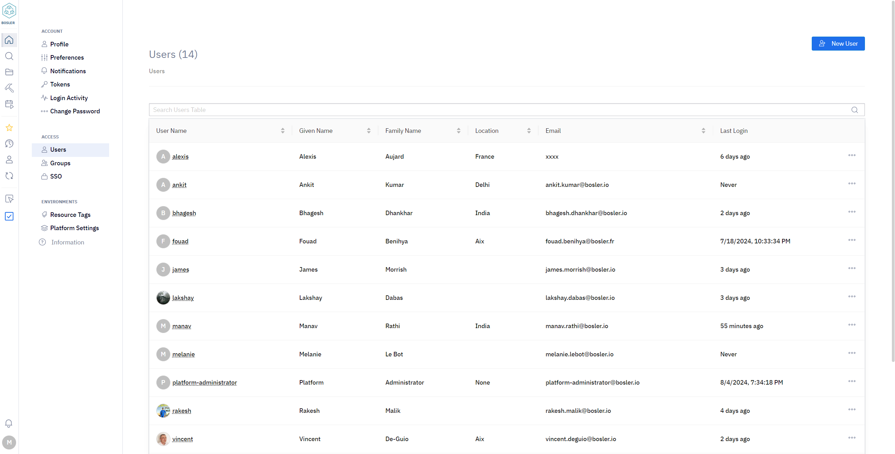
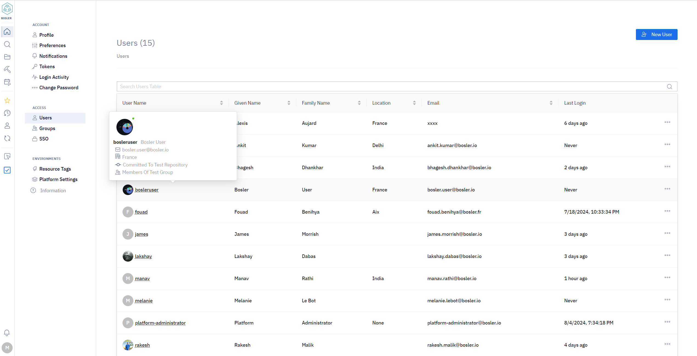
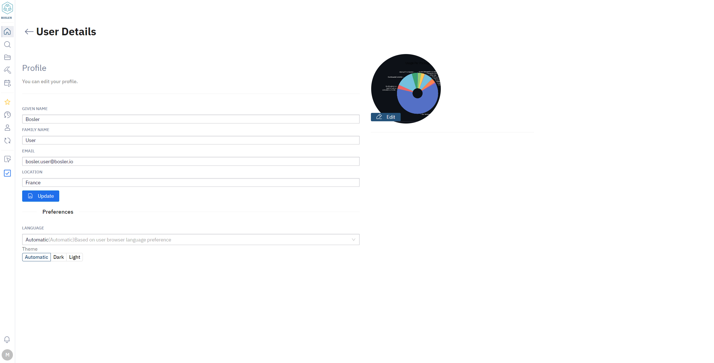

# Gestion des utilisateurs

Bosler permet aux administrateurs de gérer les utilisateurs sur une seule page.

Dans cette page située dans les paramètres, il est simple de voir rapidement tous les utilisateurs et les détails clés tels que :

- Nom d'utilisateur
- E-mail
- Dernière connexion
- Et bien d'autres

## Création d'utilisateurs

La création d'un utilisateur est un processus simple.

- Accédez à la page Paramètres et accédez à l'onglet Utilisateur
- En haut à droite de la page, sélectionnez Nouvel utilisateur
- Entrez les détails de l'utilisateur
- Sélectionnez Créer

      <ReactPlayer className="video__player" controls height="100%" url="/learn/security/create-User.mp4" width="100%" />

## Trouver plus de détails sur l'utilisateur

Passer la souris sur un utilisateur fera apparaître une boîte affichant les détails. Ici, vous pouvez voir à quel niveau de quel groupe cet utilisateur appartient. Par exemple, l'administrateur de projet ci-dessous se trouve dans les membres du référentiel de test du groupe de test.

## Modification des utilisateurs

Les utilisateurs peuvent modifier leur propre profil à tout moment en sélectionnant leur profil d'utilisateur personnel dans l'onglet Utilisateur. Cela mettra à jour leur profil avec leurs nouveaux détails.

