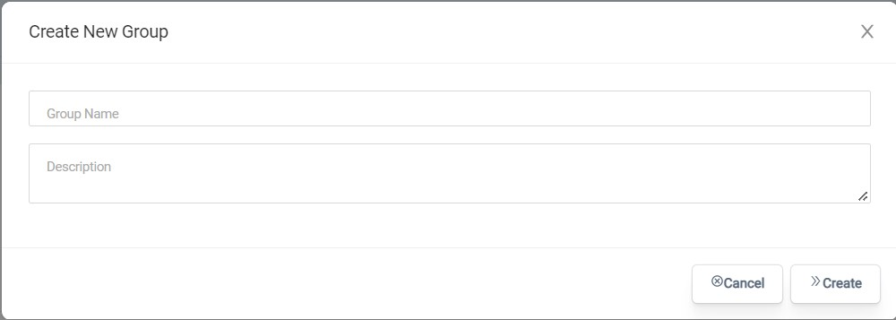

# Gestion de groupe

 Dans MoveToData, les administrateurs peuvent créer des groupes de sécurité et peuvent avoir un accès et un contrôle complets sur ces groupes pour déléguer des rôles de sécurité à certains utilisateurs.

Les administrateurs peuvent accéder aux paramètres de gestion des groupes dans la page Paramètres sous l'onglet Groupes.

Tous les groupes seront répertoriés ici avec la possibilité de modifier, supprimer et créer d'autres groupes. Lors de la configuration initiale de MoveToData dans votre établissement, trois groupes seront prédéfinis :

- Administrateurs d'utilisateurs
- Administrateurs de groupe
- Administrateurs de projet

Les groupes peuvent aider à gérer les autorisations dont disposent les utilisateurs de MoveToData. Ils peuvent aller de la vue uniquement aux éditeurs. Le système de gestion de groupe de MoveToData offre une facilité d'utilisation en déléguant des autorisations à un groupe de personnes.

## Créer un groupe

Créer un groupe dans MoveToData est un processus simple.

- Accédez à la page Paramètres et accédez à l'onglet Groupes
- En haut à droite de la page, sélectionnez nouveau groupe
- Entrez le nom du groupe et une description du groupe (facultatif)

Vous pouvez cliquer sur un groupe et gérer les membres, les propriétaires et les gestionnaires

Les membres sont le rôle de base dans un groupe, ils ne peuvent modifier aucun groupe et ne peuvent accéder qu'au groupe de projet auquel ils ont été affectés dans MoveToData.

Les gestionnaires peuvent modifier le groupe pour ajouter ou supprimer des utilisateurs tandis que les propriétaires ont également le rôle supplémentaire de supprimer. 

