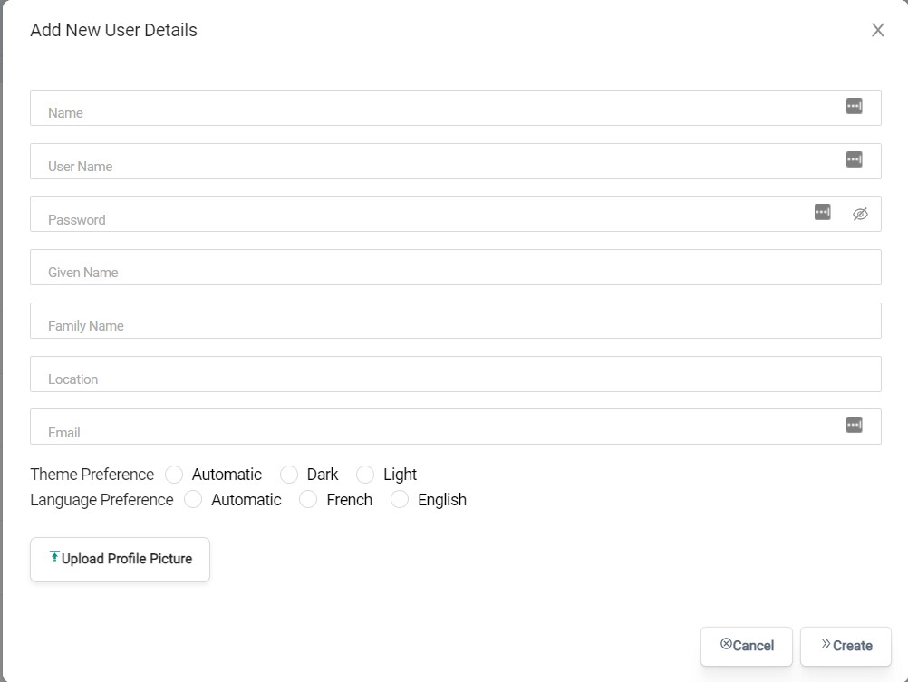
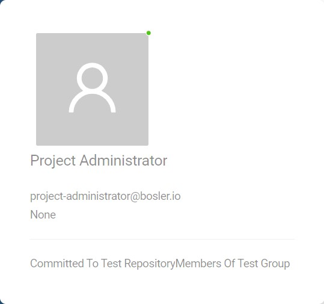

# Gestion des utilisateurs

 MoveToData permet aux administrateurs de gérer les utilisateurs dans MoveToData sur une seule page.

IDans cette page située sous les paramètres MoveToData, il est simple de voir rapidement tous les utilisateurs de l'environnement MoveToData et les détails clés tels que :

- Nom d'utilisateur
- E-mail
- Dernière connexion
- Et bien d'autres

## Création d'utilisateurs

La création d'un utilisateur dans MoveToData est un processus simple.

- Accédez à la page Paramètres et accédez à l'onglet Utilisateur
- En haut à droite de la page, sélectionnez Nouvel utilisateur
- Entrez les détails de l'utilisateur
- Sélectionnez Créer

## Trouver plus de détails sur l'utilisateur

Passer la souris sur un utilisateur dans l'onglet Utilisateur fera apparaître une boîte affichant les détails. Ici, vous pouvez voir à quel niveau de quel groupe cet utilisateur appartient. Par exemple, l'administrateur de projet ci-dessous se trouve dans les membres du référentiel de test du groupe de test.

## Modification des utilisateurs

Les utilisateurs peuvent modifier leur propre profil à tout moment en sélectionnant leur profil d'utilisateur personnel dans l'onglet Utilisateur. Cela mettra à jour leur profil avec leurs nouveaux détails.

