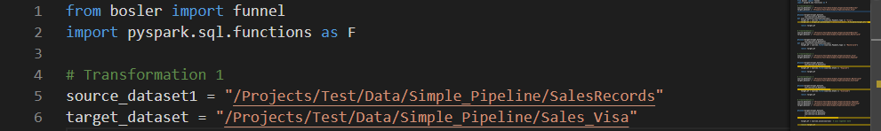

# Aperçu

<div style="text-align: justify">Code Repositories est un IDE basé sur le Web qui permet aux utilisateurs d'écrire et de collaborer sur du code prêt pour la production au sein de MoveToData. La plate-forme dispose d'une interface conviviale pour interagir avec les référentiels Git et offre diverses fonctionnalités supplémentaires telles que:

- Effectuer des actions courantes de contrôle de version Git telles que la création de branches, la validation et le balisage des versions via l'interface Web.

- Prise en charge de la collaboration et de la révision du code via des demandes d'extraction, avec des autorisations personnalisables pour garantir la qualité du code.

- Des outils intégrés pour améliorer l'expérience de création de code, y compris IntelliSense, le linting de code, la vérification des erreurs et des boîtes de dialogue d'aide enrichies.

# Types de référentiels

Code Repositories offre un support pour la création de différents types de référentiels, chacun avec son propre ensemble de fonctionnalités.

- Les référentiels de transformations sont conçus pour créer une logique de transformation de données. Ils fournissent des outils pour prévisualiser et déboguer les transformations et prennent en charge plusieurs langages de programmation tels que Python, et SQL.
  
- Les référentiels de fonctions sont destinés à écrire une logique métier pouvant être exécutée rapidement dans un cadre opérationnel. Ils sont livrés avec une prise en charge intégrée pour accéder aux données de l'ontologie MoveToData et incluent la saisie semi-automatique TypeScript basée sur les types de données Ontology.
  
<p style="text-indent: 20px;">De plus, l'environnement permet de prévisualiser les fonctions pendant leur création, et toutes les fonctions sont écrites en TypeScript. Code Repositories fournit également un support pour le développement de modèles.</p>

- [En savoir plus sur le développement de modèles.](../analyse/overview.md)

# Transformer les données

La transformation d'ensembles de données fait référence au processus de manipulation, de modification ou de conversion de données d'une forme à une autre afin de les rendre plus adaptées à l'analyse, à la modélisation ou à d'autres fins.

<p style="text-indent: 20px;">MoveToData utilise PySpark, un langage de programmation qui permet d'interagir avec Apache Spark, un puissant framework de traitement de données. Avec PySpark, vous pouvez rapidement et facilement travailler avec de très grands ensembles de données sur plusieurs serveurs, ce qui peut apporter des améliorations significatives en termes de performances et de fiabilité.</p>

<p style="text-indent: 20px;">DataFrame : un DataFrame est une structure de données semblable à une table composée de colonnes et de lignes nommées. Sa structure ressemble à une base de données SQL, mais elle n'est pas relationnelle. Une fois créé, un DataFrame ne peut pas être modifié, mais il peut être utilisé pour créer un nouveau DataFrame avec des données transformées. Bien que les ensembles de données puissent être écrasés, MoveToData garde une trace de l'historique des versions, de sorte que vous pouvez toujours revenir aux versions précédentes. Les transformations DataFrame sont évaluées paresseusement, ce qui signifie qu'une série de tâches est évaluée comme une seule action et exécutée uniquement lorsqu'une génération est lancée.</p>

<p style="text-indent: 20px;">RDD : Resilient Distributed Datasets est la structure de données fondamentale qui prend en charge les opérations DataFrame. En décomposant le DataFrame en sous-ensembles qui ne se chevauchent pas et en les répartissant sur un cluster d'ordinateurs (nœuds). PySpark peut exécuter des transformations en parallèle sur plusieurs nœuds. Bien que ce processus se déroule en arrière-plan, il est essentiel de garder à l'esprit lorsque vous travaillez avec PySpark.</p>

<p style="text-indent: 20px;">Les Spark DataFrames sont spécialement conçus et optimisés pour gérer des quantités massives de données structurées pouvant aller de pétaoctets à des ensembles de données encore plus volumineux. Cette fonctionnalité permet aux DataFrames de traiter et de manipuler des données dans un environnement informatique distribué, ce qui les rend idéales pour les applications Big Data.</p>

<p style="text-indent: 20px;">PySpark génère des ensembles de données entièrement nouveaux par opposition à SQL, qui produit des ensembles de résultats de table virtuelle. Cette fonctionnalité permet la création de nouveaux ensembles de données basés sur des ensembles de données dérivés. De plus, MoveToData, un système d'exploitation de données, relie automatiquement les ensembles de données via des relations arborescentes dirigées, ce qui aide à suivre la lignée des données des transformations Spark via Bézier. Cela fournit un moyen d'explorer les dépendances qui entrent dans la création d'un ensemble de données et d'où proviennent ces ensembles de données.</p>

## Principes de base du code PySpark

Ce guide vous aidera à transformer différents ensembles de données dans MoveToData. Voici un tutoriel étape par étape pour transformer des données :
- Connectez-vous à votre compte
- Sélectionnez Projets dans le menu de la barre latérale
- Sélectionnez votre dossier sous le tableau des projets
- Sélectionnez vos dossiers particuliers pour ouvrir l'ensemble de données
- En haut à droite de l'écran cliquez sur repository
- Vous serez redirigé vers la page Code Workbook and Repository.
- Vous pouvez écrire du code en Python, PySpark ou R.

<p style="text-indent: 20px;">Dans les référentiels de code, au début de votre script Python, vous devez généralement inclure une instruction d'importation pour accéder à diverses fonctions fournies par des bibliothèques ou des modules externes.</p>

<p style="text-indent: 20px;"><b>Voici à quoi ressemblerait votre page:</b></p>



<p style="text-indent: 20px;"><code>jeu de données source</code>: fait référence à un DataFrame qui représente un Dataset stocké dans MoveToData.</p>

<p style="text-indent: 20px;"><code>jeu de données cible</code>: dans cette fonction est l'endroit où vous pouvez définir une série de transformations que vous souhaitez voir appliquées à <code>jeu de données source</code>. Une fois que vous avez déclenché une génération avec votre code, les résultats sont enregistrés dans un nouveau fichier Dataset dans MoveToData, que vous pouvez explorer une fois la génération terminée.</p></div>

## Filtration

Ce code ci-dessous filtrera la trame de données sur la colonne Payment_Type pour "Visa":

```python
@funnel(target=target_dataset,
        source1=source_dataset1)
def user_transform_function(source1):
    target_df = source1.filter(source1.Payment_Type == "Visa")

    return target_df
```
Ce code ci-dessous filtrera la trame de données sur la colonne Payment_Type pour "MasterCard":
```python
@funnel(target=target_dataset,
        source1=source_dataset1)
def user_transform_function(source1):
    target_df = source1.filter(source1.Payment_Type == "MasterCard")

    return target_df
```
Ce code ci-dessous filtrera la trame de données sur la colonne en "MasterCard" et changera le nom de la colonne en "Date de transaction":

```python
@funnel(target=target_dataset,
        source1=source_dataset1)
def user_transform_function(source1):
    target_df = source1.filter(source1.Payment_Type == "MasterCard")
    target_df = target.dfwithColumn("Transaction Date", F.to_date(target_df["Transaction date"], "M/d/yyyy HH:mm"))

    return target_df
```

Ce code ci-dessous filtrera le dataframe sur la colonne State pour "England":

```python
@funnel(target=target_dataset,
        source1=source_dataset1)
def user_transform_function(source1):
    target_df = source1.filter(source1.State == "England")

    return target_df
```
Ce code ci-dessous filtrera le dataframe sur la colonne State pour "Scotland":

```python
@funnel(target=target_dataset,
        source1=source_dataset1)
def user_transform_function(source1):
    target_df = source1.filter(source1.State == "Scotland")

    return target_df
```

## Jointures

Ce code ci-dessous joindra les deux dataframes (sources) dans un nouveau dataframe.

```python
@funnel(target=target_dataset,
        source1=source_dataset1,
        source2=source_dataset2)
def user_transform_function4(source1, source 2):
    target_df = source2.union(source1) #réunissant les deux

    return target_df
```

## Changements de colonne

Ce code ci-dessous changera le nom de la colonne du dataframe :

```python
@funnel(target=target_dataset,
        source1=source_dataset1)
def user_transform_function(source1):
    target_df = source1.filter(source1.Payment_Type == "MasterCard")
    target_df = target_df.withColumnRenamed("Product", F.to_number(target_df["Product no."], "Product"))

    return target_df
```

## Date et horodatage

Ce code ci-dessous sera converti en date et horodatage de la trame de données :

```python
@funnel(target=target_dataset,
        source1=source_dataset1)
def user_transform_function(source1):
    target_df = source1.filter(source1.Payment_Type == "MasterCard")
    target_df = target_df.withColumn("Transaction_date", F.to_date(target_df["Transaction date"], "M/d/yyyy HH:mm"))

    return target_df
```
