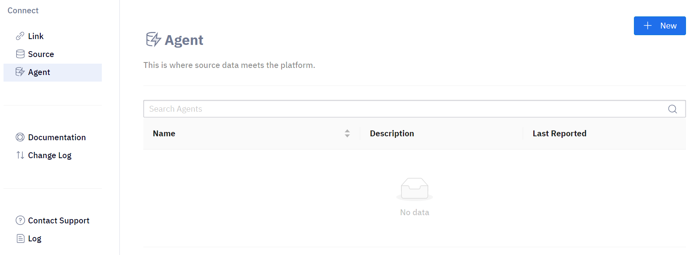

# Install Agents

A program called an Agent can be downloaded and added to your organizational network. It is managed through MoveToData's Data Connection interface also known as Ignite.
The Agent can connect to various data sources within your network and its main function is to retrieve data from these sources and securely send it to MoveToData using a secure access token.

## Ignite

MoveToData's data ingestion Agent software is called Ignite.

## Create Agent

This guide will take you through the process of creating an Agent using Ignite. In addition, you can find a step-by-step tutorial for creating an Agent within Data Connection. To access it:

- Log in to your account
- Go to Data Connection using the sidebar menu

- Under the Agents tab, select the option for "New Agent" in the top-right corner

- Enter name for the agent with description and parent folder
- Click Create

A pop up should appear with Agent Details with a one-time use link for the agent.
Input command into the terminal to install the agent onto the client side.

### Note

:::note

The agent **works** Linux and MacOS.
