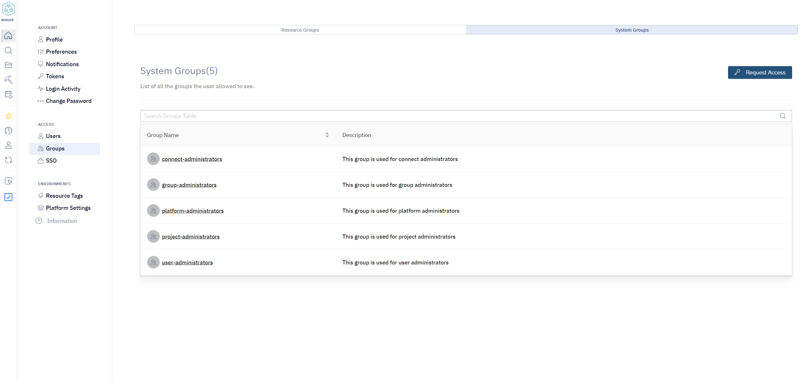

# Group Management

In MoveToData, Administrators can create security groups and can have full access and control over those groups to delegate security roles to certain users.

Administrators can access group managements settings in the Settings page under the Groups tab.

All groups will be listed here with the option to edit, delete, and create more groups. In the initial set up of MoveToData in your establishment, there will be three groups pre-set:

- Users Administrators
- Group Administrators
- Project Administrators

Groups can help manage which permissions MoveToData users can have. They can range from view only to editors. MoveToData's Group Management system provides ease of use in delegating permissions to a group of people.

## Creating a Group

Creating a group in MoveToData is a simple process.

- Navigate to the Settings page and go to the Groups tab
- On the top right of the page, select new group
- Enter Group Name and a description of group (Optional)

### Managing a Group

| Access Level               | Member | Manager | Owner |
|----------------------------|:------:|:-------:|:-----:|
| Add Members                |   ❌   |    ✔️   |  ✔️  |
| Remove Members             |   ❌   |    ✔️   |  ✔️  |
| Add Managers               |   ❌   |    ❌   |  ✔️  |
| Remove Managers            |   ❌   |    ❌   |  ✔️  |
| Delete Group               |   ❌   |    ❌   |  ✔️  |
| Grants access to resources |   ✔️   |    ❌   |  ❌  |

You can click on a group and manage members, owners, and managers

Members are the base role in a group, they cannot edit any groups and can only access the project group they have been assigned to in MoveToData.

Managers can edit the group to add or remove users while Owners also have the additional role to delete.

