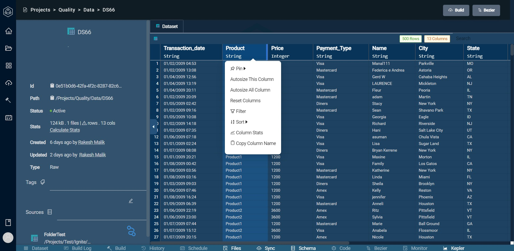
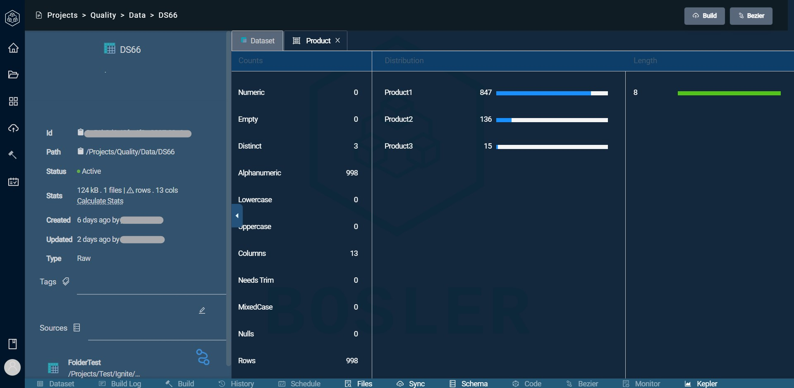

# Statistics

Statistics play a big role in using Orphea to its maximum potential.
Orphea allows you to view statistics of any column in a dataset

## Accessing Statistics

Navigate to this page through:

- Projects tab
- Select a Project
- Select Data
- Click on a dataset

Hover over a column and click on the three lines  
The option for Column Stats should appear

Here you can see multiple types of statistics regarding the column

