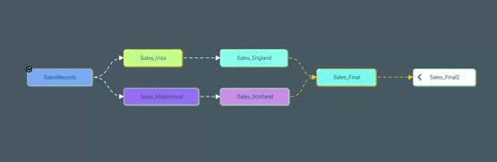

# Aperçu

Présentation de Orphea - une plate-forme d'opérations tout-en-un qui connecte de manière transparente les équipes de données, d'analyse et opérationnelles. Les utilisateurs techniques et non techniques peuvent facilement collaborer sur des défis organisationnels complexes en utilisant la large gamme de services de Orphea. Ces services sont organisés en catégories distinctes, ce qui facilite la recherche des outils adaptés à vos besoins. Avec une configuration minimale requise, la conception modulaire de Orphea vous permet de rationaliser et d'optimiser vos opérations. Parcourez nos services pour voir comment Orphea peut aider votre organisation :

- Ingestion de données
- Transformation de données
- Analyse / Visualisation
- Sécurité

### Ingestion

Orphea fournit un cadre de connexion de données flexible qui s'intègre de manière transparente aux systèmes d'entreprise. Il utilise Kubernetes pour un traitement de données par lots efficace et évolutif, et propose une gestion et une orchestration unifiées des pipelines. La plate-forme comprend également une surveillance intégrée pour tous les flux de données, ainsi que des fonctionnalités de sécurité robustes telles que des contrôles d'accès basés sur les rôles, la classification et les objectifs. Cela permet aux organisations de gérer, de surveiller et de sécuriser facilement leurs flux de données à travers l'entreprise.

**Pour en savoir plus sur la manière dont Orphea gère l'ingestion de données, veuillez cliquer sur les liens ci-dessous :**

- Ingestion de données
- En savoir plus sur le pipeline de données
- Surveillance des ensembles de données

### Transformation

Orphea est une plate-forme tout-en-un qui permet aux utilisateurs de créer des modèles à l'aide de langages de programmation populaires tels que Python et R. La plate-forme est conçue pour rendre le processus de création de modèle aussi transparent que possible. Il comprend un éditeur de code intégré et des fonctionnalités de gestion des versions de code telles que Github, permettant aux utilisateurs d'écrire et de gérer facilement leur code. Cela permet aux utilisateurs de collaborer facilement sur des projets et de suivre les modifications apportées à leur code au fil du temps.

De plus, Orphea permet l'intégration de modèles créés avec des outils standard de l'industrie, ce qui permet aux utilisateurs de tirer facilement parti de leurs connaissances et de leur expérience existantes. Cela permet aux organisations de continuer à utiliser les outils avec lesquels elles sont déjà familières, tout en profitant des nombreuses fonctionnalités de la plateforme.

La plate-forme simplifie également le processus de déploiement, ce qui permet aux utilisateurs de déployer facilement leurs modèles en production. Cela se fait de manière simplifiée, ce qui garantit que le modèle est déployé de la manière la plus efficace et la plus sécurisée possible. De cette façon, les organisations peuvent se concentrer sur la création de modèles plutôt que de se soucier du processus de déploiement. Dans l'ensemble, l'approche globale de Orphea en matière de création et de déploiement de modèles en fait une solution idéale pour les organisations qui cherchent à créer et à déployer des modèles rapidement et facilement.

**Pour en savoir plus sur la manière dont Orphea gère la transformation des données, veuillez cliquer sur les liens ci-dessous:**

- Référentiel de code
- Data Lineage (Bézier)

### Visualisation

Orphea propose une gamme de graphiques et de tableaux de bord intégrés hautement personnalisables pour répondre aux besoins spécifiques des utilisateurs. Ces graphiques et tableaux de bord fournissent une interface facile à utiliser qui permet aux utilisateurs de visualiser rapidement et efficacement les performances de leurs modèles. Le niveau de personnalisation disponible sur Orphea est assez étendu, permettant aux utilisateurs d'adapter la représentation visuelle de leurs données à leurs spécifications exactes. Cela permet aux utilisateurs d'identifier facilement les modèles et les tendances dans leurs données et de prendre des décisions plus éclairées sur la manière d'optimiser leurs modèles. Les graphiques et tableaux de bord personnalisables fournis par Orphea sont un outil puissant pour l'analyse des données et la surveillance des performances des modèles.

**Pour en savoir plus sur les capacités d'analyse de Orphea, veuillez suivre les liens ci-dessous:**

- Graphiques
- Tableaux de bord

### Sécurité

La sécurité et la lignée sont fondamentales pour chaque aspect de Orphea et sont constamment maintenues dans toute l'architecture de la plate-forme. Cela garantit qu'aucun service ou utilisateur n'est seul responsable de l'application des politiques de sécurité de l'organisation ou du suivi de la provenance des données. Au lieu de cela, les services de base de la plate-forme sont conçus pour mettre en œuvre, appliquer et surveiller les politiques de gouvernance qui sont configurées, synchronisées et héritées. De cette façon, Orphea peut garantir que toutes les opérations sont conformes aux normes de l'entreprise en matière de sécurité et de gouvernance des données.

De l'ingestion de données à la prise de décision, l'architecture de Orphea est conçue pour maintenir la sécurité et l'intégrité des données tout au long du processus. Les politiques de gouvernance de la plateforme sont constamment surveillées et mises à jour pour assurer la conformité avec les dernières normes et réglementations de l'industrie. De plus, la fonction de lignage des données de Orphea permet aux utilisateurs de retracer l'origine et le flux des données dans le système, fournissant un enregistrement clair et détaillé de la provenance des données. Cela aide les organisations à répondre aux exigences de conformité réglementaire et à maintenir la transparence et la confiance avec les clients et les parties prenantes.

Dans l'ensemble, l'accent mis par Orphea sur la sécurité et la lignée garantit que toutes les opérations de données sont menées de manière sécurisée et conforme, en préservant la sécurité des données sensibles de l'entreprise et de la confiance des clients.

**Pour en savoir plus sur les capacités de sécurité de Orphea, veuillez suivre les liens ci-dessous :**

- Gestion des utilisateurs
- Gestion de groupe
- Jetons
