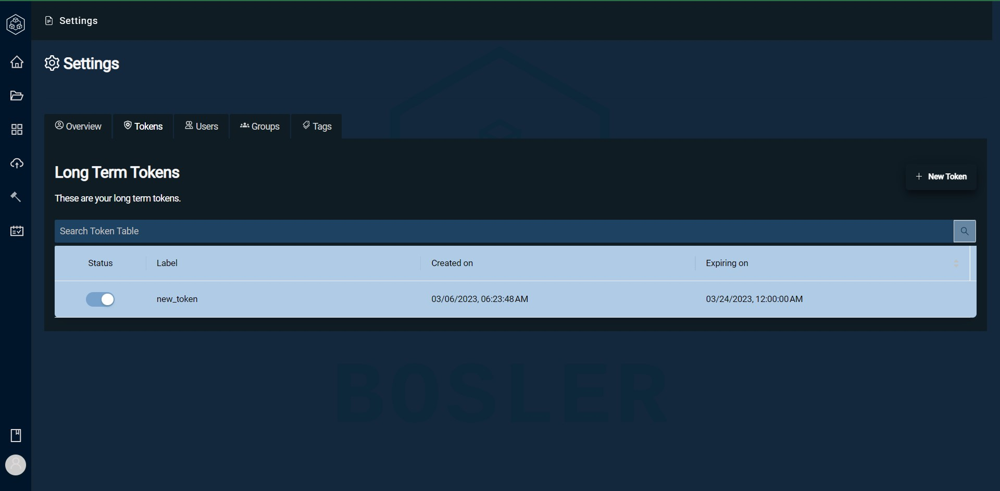

# Jetons

Les jetons sont la méthode d'authentification de sécurité de Orphea.
Orphea utilise des jetons pour envoyer et recevoir des données vers et depuis des systèmes externes.

## Jeton à court terme

Chaque fois qu'un utilisateur se connecte à Orphea, il génère un jeton à court terme attribué à son profil qui dure une journée. Cela permet à l'utilisateur de rester connecté toute la journée, ce qui réduit le besoin de se connecter plusieurs fois tout en garantissant la sécurité. Les jetons peuvent également être utilisés pour les capacités d'authentification unique dans Orphea

## Jetons à long terme

Orphea utilise des jetons à long terme pour que les systèmes externes envoient et reçoivent des données. Seuls les administrateurs peuvent générer des jetons et les attribuer. Les jetons peuvent être consultés dans la page des paramètres sous l'onglet Jetons.

## Création d'un jeton

La création d'un jeton dans Orphea est un processus simple.

- Accédez à la page Paramètres et accédez à l'onglet Jeton
- En haut à droite de la page, sélectionnez Nouveau jeton
- Entrez les détails du jeton
- Sélectionnez Créer
- Copiez votre jeton dans le presse-papiers

