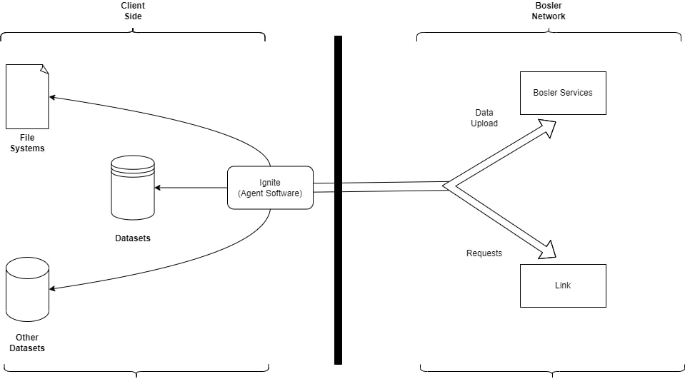

# Aperçu

## La configuration initiale

Cette documentation vous guidera tout au long du processus d'établissement d'une connexion entre les données de votre organisation et la plateforme Orphea.

Il est important de noter que la configuration initiale de cette connexion est principalement une tâche de mise en réseau. Elle doit être gérée par un membre de votre équipe informatique qui connaît la topologie du réseau et les configurations de pare-feu de votre organisation.

## Concept

Afin de connecter des données à Orphea, les trois composants suivants doivent être correctement installés et configurés : l'Agent, la Source et le Lien.

### Agent

L'agent, un composant logiciel qui s'exécute au sein du réseau d'une organisation, sert d'intermédiaire sécurisé entre les sources de données et Orphea. Il est nécessaire pour se connecter à certaines sources de données, sauf si la source de données est une source basée sur le cloud à laquelle Orphea peut accéder directement.

:::tip
Un seul agent peut prendre en charge plusieurs sources de données et liens.
:::

### Les sources de données

Pour établir une connexion avec Orphea, il est nécessaire d'utiliser un système de données externe appelé Source.

Ces sources peuvent inclure, entre autres, une base de données Postgres, un compartiment S3, un système de fichiers sur un serveur Linux, une instance SAP ou une API REST. Il est important de comprendre qu'une source ne peut pas être directement accessible dans Orphea, car les données doivent être synchronisées dans un dataset avant de pouvoir être utilisées.

:::tip
Une seule source de données peut prendre en charge plusieurs liens. Par exemple, vous pouvez lier plusieurs tables postgres à Orphea ou plusieurs fichiers csv à partir d'un dossier.
:::

### Liens

Un lien est chargé d'obtenir des données spécifiques d'une source et de les intégrer dans Orphea. Par exemple, si une source de base de données Postgres contient plusieurs tables, il est possible de configurer un lien pour ingérer une table particulière dans Orphea. Une fois qu'un lien a été exécuté avec succès, le résultat au sein de Orphea sera un dataset, qui peut être utilisé dans tous les outils de traitement de données, de développement de modèles et d'analyse de Orphea.
